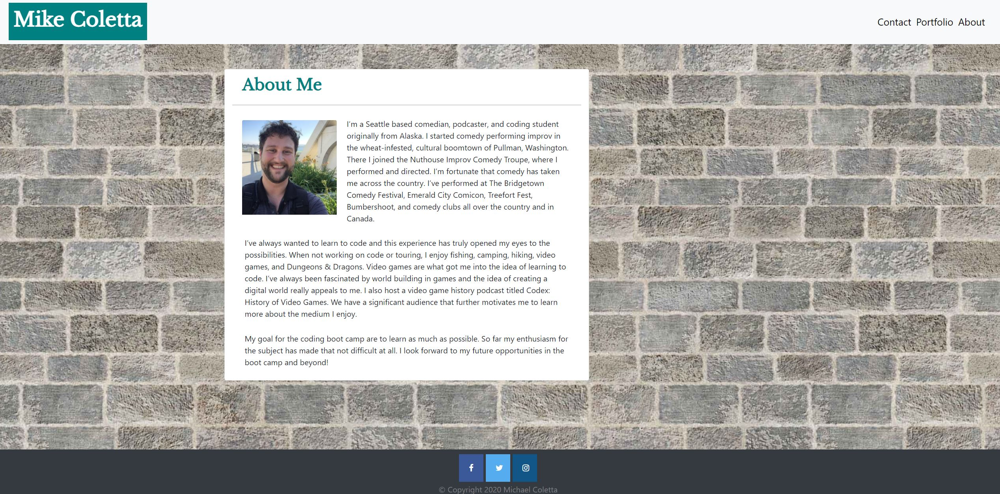
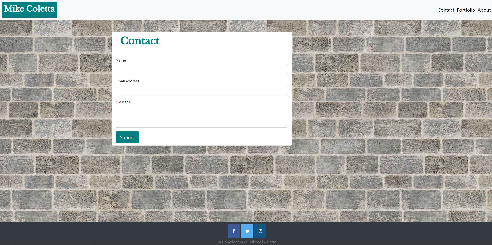
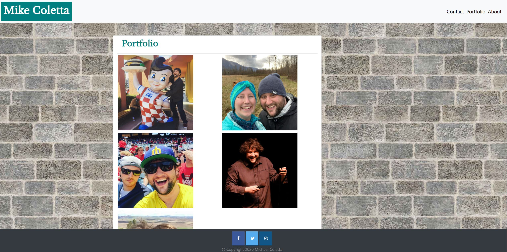

# Responsive-Portfolio

## Project Description

My task was to create a responsive portfolio website for myself that included about me, portfolio, and contact pages. This will later be modified to hold my actual portolio upon leaving class.

## My Process

My first priority was setting up the basic functionality of the website. I took the information I found on the Bootstrap website and adjusted the classes and code to fit my needs. This laid out the Navbar, and main content cards for each section.

Next I worked on the responsiveness. After getting some help from my tutor on how to start, I spent a majority of my time in the Google Inspector switching screen sizes back and forth to match the photos given to me for the assignment.

After I felt my responsivness was in a good place I decided to work on the more cosmetic details of my website. This included adding the google fonts. I chose Libre Baskerville since it seemed closest to the asset images provided. I also noticed at this point I was missing the copyright footer, so I added that too. 

The final stages of the project included the finer details. This was a lot of work with font sizes and margins on each page and reformatting the contact button. I also spent this time looking for a subtle background image for my portfolio as well. I then wrote the bio.

After I submitted, I noticed I forgot to switch out the blank photos and add social media links. I added those post submission and pushed the changes. I also fixed the contact box margin on the bottom to fit the submit button better.

## Project Link
[Deployed Link](https://mikecoletta.github.io/Responsive-Portfolio/)

## Site Screenshot

## Credits

Bootstrap 4.5 Layout (https://getbootstrap.com/docs/4.5/layout/overview/)

Bootstrap 4.5 Navbar (https://getbootstrap.com/docs/4.5/components/navbar/)

Bootstrap 4.5 Cards (https://getbootstrap.com/docs/4.5/components/card/)

Brick Background (https://www.pexels.com/photo/wall-bricks-220182/)

Bootstrap 4 Sticky Footer Not Sticking (https://stackoverflow.com/questions/46722697/bootstrap-4-sticky-footer-not-sticking)

HTML Validator (https://validator.w3.org/)