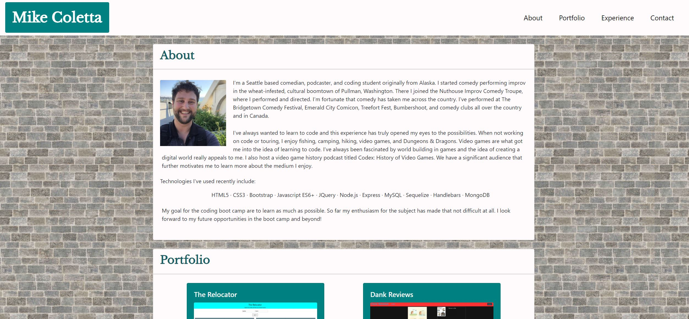
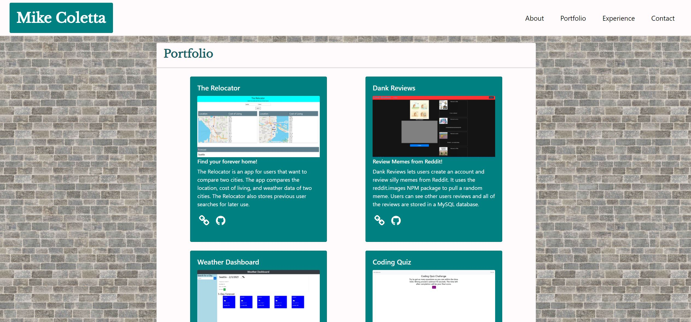
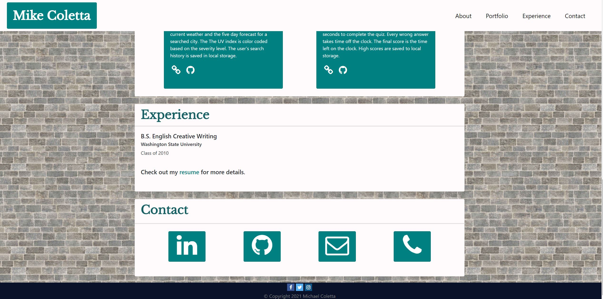

# Responsive-Portfolio

## Project Description

I created a responsive portfolio website for myself that included about me, portfolio, and contact pages. This will later be modified to hold my actual portolio upon leaving class.
## Table of Contents
1. [Installation](#installation)
2. [Usage](#usage)
3. [License](#license)
4. [Questions](#questions)
5. [Credits](#credits)

## Installation
[Deployed Link](https://mikecoletta.github.io/Portfolio/)

## Usage

## License
    
MIT License
    
Copyright (c) 2021 Mike Coletta
          
## Questions?
    
[Github](https://github.com/MikeColetta)
    
For any questions, please send me an [email](mailto:coletta.mike@gmail.com).